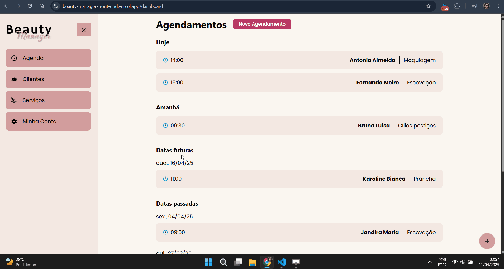

# **BeautyManager - Front-End**

[](https://nextjs.org/)
[](https://www.typescriptlang.org/)
[](https://chakra-ui.com/)
[](https://vercel.com/)
[](https://opensource.org/licenses/MIT)

## 💡 **Sobre**
O **BeautyManager** é um sistema web **SaaS (Software as a Service)** projetado especificamente para a gestão completa de salões de beleza e barbearias. Esta aplicação front-end, construída com **Next.js** e **TypeScript**, oferece aos proprietários e gerentes uma interface moderna e intuitiva para administrar clientes, agendamentos, serviços e assinaturas premium, otimizando a operação do negócio.

A interface se integra perfeitamente com a [API Back-End do BeautyManager](https://github.com/Antonio-Savio/BeautyManager-back-end) e utiliza o **Stripe** para um gerenciamento seguro e eficiente de pagamentos e assinaturas.

---
## 🌐 **Sistema em funcionamento**

https://github.com/user-attachments/assets/8f725397-0498-4d3a-a0fc-fb5243468141



---

## 🔗 **Links da aplicação**
- [Deploy front-end](https://beauty-manager-front-end.vercel.app/)
- [Deploy back-end](https://beauty-manager-back-end.vercel.app/)
- [Repositório do back-end](https://github.com/Antonio-Savio/BeautyManager-back-end)

---

## ✅ **Funcionalidades Principais e Destaques**
- **Modelo SaaS com Assinaturas:** Sistema projetado como Software as a Service, com funcionalidades premium gerenciadas via assinaturas pagas através do **Stripe**.
- **Autenticação**: login seguro armazenando a sessão a partir de cookies contendo o token JWT.
- **Autorização**: validação de acesso a rotas protegidas e públicas, utilizando o arquivo de **middleware do Next.js**. 
- **Integração com API Otimizada (Axios):**
    - Configuração centralizada do Axios (`setupAPI`) com interceptors para injeção automática do token JWT nos headers e tratamento padronizado de erros.
    - Distinção entre chamadas API no lado do cliente (`clientApi`) e no lado do servidor (`serverApi`) para otimizações de SSR/SSG do Next.js.
- **Interface Moderna e Responsiva (Chakra UI):** UI elegante, consistente e totalmente responsiva, construída com a biblioteca de componentes Chakra UI, adaptando-se a diferentes tipos de dispositivos.
- **Funcionalidades Premium**:
    - Visulizar tabela de clientes, com o total gasto por cada um, e ordenada de acordo com o número de agendamentos feito.
    - Editar ou excluir clientes.
    - Cadastrar serviços ilitimitados.
- **Modais Interativos:** Modais para detalhes de agendamentos e confirmação de exclusões críticas (ex: excluir cliente/serviço com agendamentos vinculados).
- **Utilitários:** Funções auxiliares para formatação de moeda (BRL), datas e horários para o padrão local (`src/utils`).
- **Dropdown com links**: componente que facilita o cadastro de um novo agendamento/cliente/serviço.
- **Toast de notificações**: mensagens de sucesso, ou erro são exibidas conforme ações do usuário.

---

## ⚙️ **Tecnologias Utilizadas**
*   **Framework:** Next.js (React)
*   **Linguagem:** TypeScript
*   **Biblioteca UI:** Chakra UI
*   **Requisições HTTP:** Axios
*   **Gerenciamento de Estado:** Context API
*   **Pagamentos:** Stripe.js
*   **Notificações:** React Hot Toast
*   **Manipulação de Cookies:** js-cookie (usado no client-side)
*   **Implantação:** Vercel

---

## 🔌 **Integração com API Back-End**
- A comunicação com a [**API Back-End**](https://github.com/Antonio-Savio/BeautyManager-back-end) é fundamental para todas as operações de dados (usuários, clientes, serviços, agendamentos, status de assinatura).
- **Axios** é utilizado para as requisições HTTP, com configurações avançadas em `src/services/api.ts` que incluem interceptors para adicionar automaticamente o token JWT (obtido dos cookies) aos headers das requisições autenticadas.
- O sistema diferencia chamadas feitas pelo navegador (`clientApi`) daquelas feitas no servidor durante o SSR/SSG (`serverApi`), garantindo que os cookies sejam corretamente manipulados em ambos os contextos.

---

## 💳 **Integração com Pagamentos (Stripe)**
O **Stripe** é integrado para gerenciar as assinaturas dos planos premium.
O front-end utiliza a biblioteca `@stripe/stripe-js` (`src/services/stripe-js.ts`) para interagir com os elementos de pagamento do Stripe (ex: redirecionar para o checkout).
A chave pública do Stripe (`NEXT_PUBLIC_STRIPE_PUBLIC_KEY`) é usada no front-end.
A lógica principal de criação de assinaturas, webhooks e verificação de status de pagamento reside na API Back-End, que utiliza a chave secreta do Stripe.

---

## 📁 **Estrutura do Projeto**
A estrutura do front-end está organizada conforme o padrão abaixo:

```
/public
  ├── images/           # Imagens, como a logo do projeto
/src
  ├── app/              # Estrutura de rotas do Next.js
  ├── components/       # Componentes reutilizáveis da interface
  ├── context/         # Contexto para autenticação
  ├── services/         # Configuração do axios
  │   └── api.ts        # 'setupAPI' cria configuração padrão para requisições HTTP | 'clientApi' faz requisições pelo lado do cliente
  │   └── serverApi.ts  # Requisições pelo lado do servidor
  │   └── stripe-js.ts  # Configuração da biblioteca stripe-js
  ├── theme/            # Definição de cores do sistema
  ├── utils/            # Funções utilitárias
  │   └── breakpoint    # Configuração de breakpoint para renderização condicional
  │   └── currency      # Função para formatar preço em Real
  │   └── datetime      # Funções de manipulação de data e horário
  └── middleware.ts     # Valida a autenticação de usuários, de acordo com rotas públicas e protegidas
```

---

## 🚀 **Como Executar o Projeto**

### **Requisitos para Executar o Projeto**
- Node.js
- NPM ou Yarn
- Git
- **API Back-End do BeautyManager** ([repositório](https://github.com/Antonio-Savio/BeautyManager-back-end)) **em execução** e acessível.
- Conta na Stripe configurada.

### **Instalação e Configuração**
Siga os passos abaixo para rodar o projeto localmente:

```bash
# Clone o repositório
git clone https://github.com/Antonio-Savio/BeautyManager-front-end.git

# Acesse o diretório do projeto
cd BeautyManager-front-end

# Instale as dependências
npm install
```

### **Configuração do Ambiente**
Crie um arquivo `.env.local` na raiz do projeto e adicione as variáveis de ambiente necessárias, como:

```bash
# URL base da sua API Back-End local ou de desenvolvimento
NEXT_PUBLIC_API_URL=http://localhost:{porta_do_seu_servidor_back-end}

# Chave Publicável da sua conta Stripe
NEXT_PUBLIC_STRIPE_PUBLIC_KEY=sua_chave_publica_Stripe
```

### **Execute em sua máquina**

```bash
npm run dev
```
A aplicação estará disponível em **http://localhost:3000**.

---
## ☁️ **Implantação / Deploy**
- O projeto está configurado para fácil implantação na **Vercel**, aproveitando as otimizações da plataforma para Next.js.
- Durante o processo de deploy na Vercel, é crucial configurar as variáveis de ambiente `NEXT_PUBLIC_API_URL` (apontando para a URL da API em produção) e `NEXT_PUBLIC_STRIPE_PUBLIC_KEY` nas configurações do projeto Vercel.

---

## 🤝 **Contribuição**
Contribuições são bem-vindas! Siga os passos abaixo:
1. Faça um fork do projeto.
2. Crie uma branch para sua feature (`git checkout -b feature/nova-feature`).
3. Commit suas mudanças (`git commit -m 'Adiciona nova feature'`).
4. Push para a branch (`git push origin feature/nova-feature`).
5. Abra um Pull Request.

---

## 📄 **Licença**
Este projeto está sob a licença MIT. Consulte o arquivo [LICENSE](LICENSE) para mais detalhes.

---

## 📧 **Contato**
Se tiver dúvidas ou sugestões, entre em contato:
- **Email** - [savio.aragao@hotmail.com](mailto:savio.aragao@hotmail.com)
- **GitHub**: [Antonio-Savio](https://github.com/Antonio-Savio)
- **LinkedIn**: [antonio-savio](https://www.linkedin.com/in/antonio-savio)
